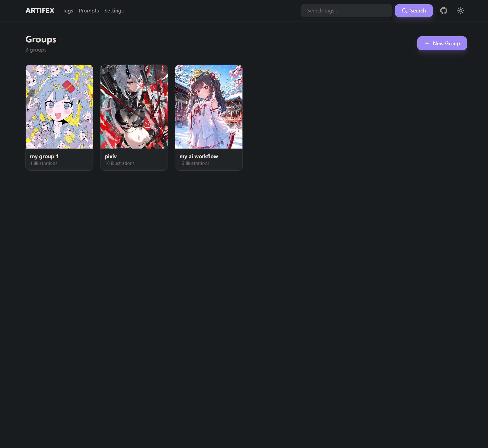
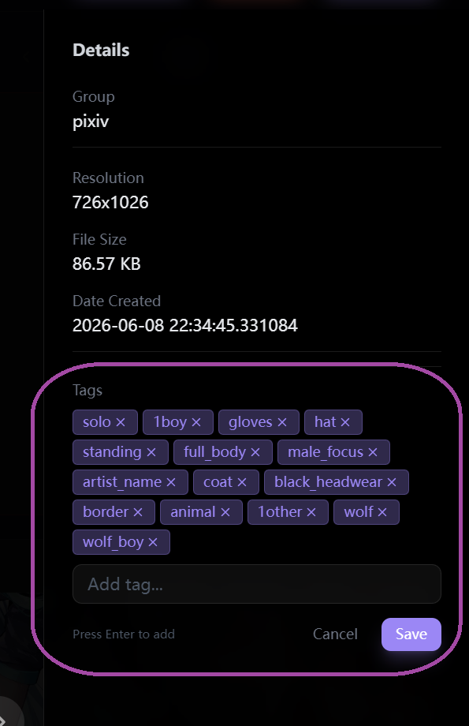
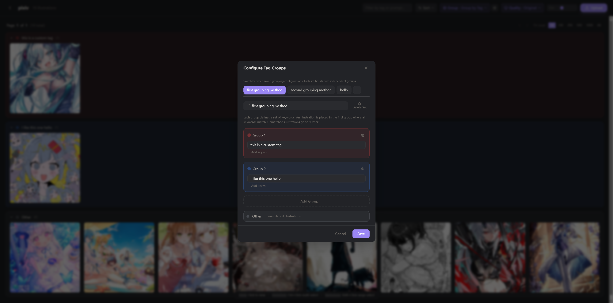
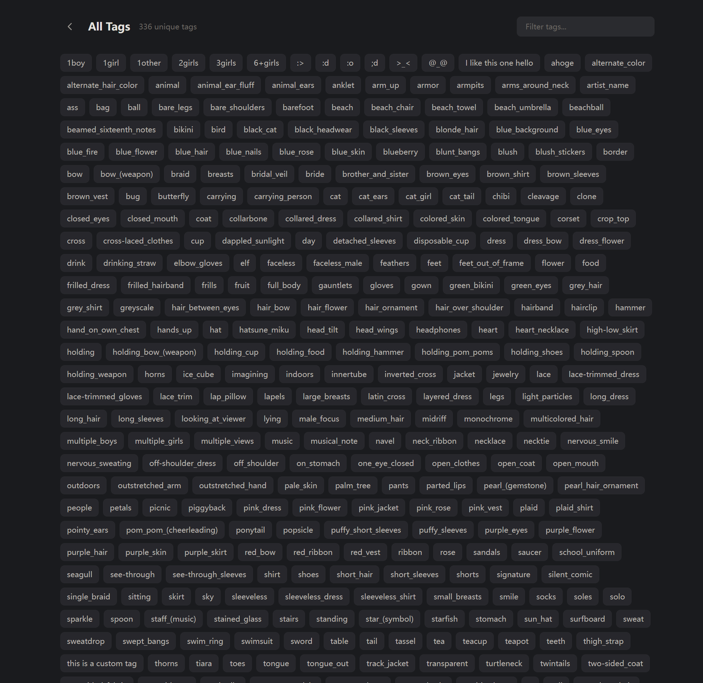
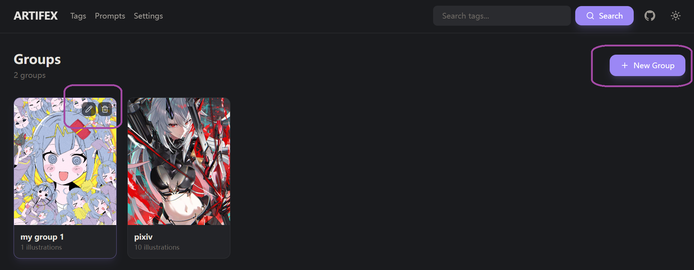
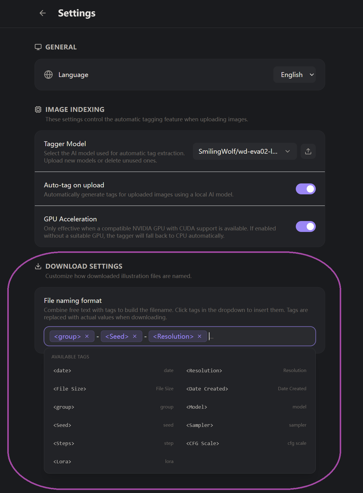

# ARTIFEX

**Artifex** 是一款自托管的图片管理工具，专为艺术爱好者和创作者设计。凭借强大的自动打标、元数据提取和视觉分组功能，帮助你组织、搜索和浏览 ComfyUI 生成的插画作品。

---

## 功能特性

### 全局标签搜索

基于 SQLite FTS5 的极速全文搜索引擎。在搜索栏（每个页面都可使用）输入任意关键词，即可瞬间匹配所有包含该标签的插画。支持前缀匹配，输入 "suns" 即可匹配 "sunset"、"sunshine"、"sunlight"。

### AI 自动打标

上传图片时，内置的 [WD EVA02-Large Tagger v3](https://huggingface.co/SmilingWolf/wd-eva02-large-tagger-v3)（约 800 MB）会自动生成描述性标签。支持 GPU 加速（CUDA），自动回退到 CPU。你也可以上传自定义的标签模型。

在设置中可以全局开关自动打标功能——当你只想使用手动标签时非常实用。

### ComfyUI 元数据提取

通过 ComfyUI 生成的图片包含丰富的元数据——Artifex 会将其全部读取。每张插画会自动提取并展示以下属性：

| 属性 | 示例 |
|----------|---------|
| **模型 (Model)** | `dreamshaperXL_v21.safetensors` |
| **正向提示词 (Positive Prompt)** | 正向提示词的完整文本 |
| **负向提示词 (Negative Prompt)** | 负向提示词的完整文本 |
| **种子 (Seed)** | `3478264912` |
| **采样器 (Sampler)** | `DPM++ 2M Karras` |
| **调度器 (Scheduler)** | `Karras` |
| **步数 (Steps)** | `20` |
| **CFG 强度 (CFG Scale)** | `7.0` |
| **LoRA** | 每个 LoRA 的名称和强度值 |
| **分辨率 (Resolution)** | `1920 x 1080` |
| **文件大小 (File Size)** | `2.4 MB` |
| **日期 (Date)** | 文件创建时间戳 |

所有元数据可在灯箱的详情面板中查看（按 `Ctrl+D` 切换）。

### 自定义标签编辑

标签并非只读——你可以自由编辑。在灯箱详情面板中，点击铅笔图标进入编辑模式，使用自动补全（来自整个库中所有已有标签）来添加或删除标签。按 Enter 添加标签，点击保存即可持久化。

你添加的自定义标签立即可通过全局搜索、标签浏览器和页面内筛选器找到——与所有依赖标签的功能无缝集成。

### 互斥色彩分组（视觉聚类）

这是 Artifex 的标志性组织功能。定义**关键词组**——每组指定一组必须全部匹配的关键词，图片才会属于该分组。图片会被分配给**第一个**匹配的分组，从而实现互斥分组。未匹配的图片归入"其他"组。

每个分组拥有独立的颜色，并以**可折叠的彩色容器**呈现——让你一眼就能区分不同的主题、角色或风格。

- **基于标签的分组**：匹配插画的标签（自动生成或自定义）
- **基于提示词的分组**：匹配从 ComfyUI 元数据中提取的正向和负向提示词文本

你可以在多套已保存的分组配置之间切换，每套配置拥有独立的分组定义。

### 标签 & 提示词浏览器

专门的页面（`/tags` 和 `/prompts`）列出库中所有唯一的标签和提示词。以可筛选的标签芯片形式浏览——点击任意标签查看有多少插画包含它，或输入文字来缩小范围。这是探索收藏词汇的绝佳方式。

### 分组管理

将插画组织到**分组**中（可以理解为相册或项目）。每个分组可以设置封面图片，并实时显示内容数量。创建、重命名或删除分组——删除分组会级联删除其中的所有插画和文件。

### 多选 & 批量操作

使用熟悉的键盘快捷键选择插画：
- **单击** 在灯箱中查看
- **Ctrl+单击** 切换单个选择
- **Shift+单击** 在两点之间范围选择

选中后可一键**批量下载**（支持自定义文件命名）或**批量删除**。

### 自定义下载命名

使用灵活的模板系统配置文件下载命名。插入占位符如 `<Model>`、`<Seed>`、`<Steps>`、`<Sampler>`、`<Resolution>`、`<Date>`、`<Group>` 等——下载时它们会被替换为每张图片的实际数据和元数据值。

### 多级质量缩略图

三种浏览画质——通过质量下拉菜单随时切换：

| 画质 | 最大尺寸 | 适用场景 |
|---------|----------|----------|
| **低** | 400 px | 快速浏览，大页面 |
| **标准** | 1200 px | 细节与性能平衡 |
| **原图** | 完整尺寸 | 像素级查看 |

缩略图在上传时生成。已有图片缺少的画质级别会在首次请求时自动生成。

### 灯箱查看器

点击任意插画打开全屏灯箱。使用方向键切换上/下一张，切换详情面板（`Ctrl+D`）查看文件信息、ComfyUI 元数据和标签。可将当前图片设为分组封面或直接删除。

### 排序、筛选 & 分页

在任意分组或搜索结果中：
- **排序** 按分辨率、文件大小或创建日期（升序/降序）
- **筛选** 通过标签或提示词的自动补全在页面内筛选（与色彩分组并行工作）
- **分页** 可配置每页数量：50、100、200、500、1000 或全部

### 顺序上传与进度显示

一次上传多张图片——它们会逐一处理，并显示实时进度条，包含文件名和百分比。失败的文件会报告错误但不会阻塞剩余图片的上传。

### 暗色 & 亮色主题

一键切换暗色和亮色配色方案。你的偏好会跨会话保持。两种主题均使用语义化颜色令牌精心设计，确保界面一致、可读。

### 国际化 (i18n)

内置**英文**和**中文**支持。所有面向用户的文本均通过翻译系统键化管理。在设置中切换语言——更改即时生效，无需刷新页面。

